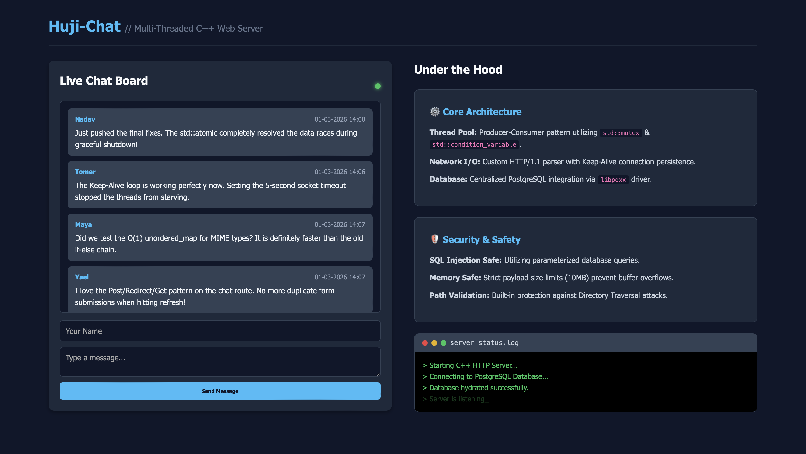

# Huji-Chat: Multi-Threaded C++ Web Server


> **Live Developer Dashboard:** Built-in split-view showing the live chat board alongside real-time server diagnostics.



Huji-Chat is a custom-built, dependency-free HTTP/1.1 web server written entirely from scratch in modern C++. It features a robust Producer-Consumer thread pool architecture, persistent data storage, and a built-in real-time chat dashboard. 

This project was developed to demonstrate low-level POSIX socket programming, concurrent system design, and strict memory safety without relying on external web frameworks.

## Key Features

* **Custom Thread Pool:** Utilizes a Producer-Consumer pattern with `std::mutex` and `std::condition_variable` to handle thousands of concurrent connections efficiently without thread exhaustion.
* **HTTP Keep-Alive:** Implements persistent TCP connections with strict socket timeouts to prevent thread starvation.
* **O(1) MIME Routing:** Fast static file serving with $O(1)$ MIME-type resolution using `std::unordered_map`.
* **Thread-Safe Database:** Hydrates and persists chat messages to disk (`chat_db.txt`), utilizing lock guards for race-condition-free concurrent reads and writes.
* **Graceful Shutdown:** Intercepts OS signals (SIGINT) and uses `std::atomic<bool>` flags to ensure all threads finish their current tasks and file descriptors are safely closed before exiting.
* **Security:** Built-in defenses against Directory Traversal attacks (`../`) and strict payload size limits to prevent buffer overflow/memory exhaustion.

## Core Architecture

### The Producer-Consumer Concurrency Model
To maximize throughput, the server avoids the overhead of spawning a new thread for every HTTP request. 

1.  **The Producer (Main Thread):** Continuously blocks on `accept()`. When a client connects, it immediately pushes the network socket (File Descriptor) onto a thread-safe task queue and signals the condition variable.
2.  **The Consumers (Worker Threads):** A pre-allocated pool of threads sleeps until signaled. Upon waking, a thread safely pops a socket from the queue, executes the HTTP Keep-Alive loop, routes the request, and transmits the payload.

## Technical Challenges & Solutions

### Graceful Shutdown & Data Races
**The Challenge:** In a multi-threaded environment, shutting down the server cleanly without leaking file descriptors or creating orphaned processes is complex. Initially, using a standard `bool stop_server` flag led to data races and undefined behavior, as CPU caching prevented worker threads from seeing the updated state. Furthermore, the main thread was permanently blocked on the `accept()` system call, preventing it from evaluating the exit condition.

**The Solution:**
To ensure a deterministic and thread-safe shutdown sequence, I implemented the following synchronization mechanisms:

1. **Atomic Flags:** Upgraded the shutdown signal to `std::atomic<bool>`. This guarantees that memory writes are instantly visible across all CPU cores without the overhead of a mutex lock.
2. **Lock-Free Execution Check:** Used `compare_exchange_strong` to ensure that if multiple threads receive a kill signal simultaneously, only the *first* thread executes the cleanup sequence.
3. **Unblocking System Calls:** To wake up the main thread trapped in the `accept()` loop, the shutdown sequence explicitly closes the main `server_fd`. This intentionally interrupts the blocking call, allowing the loop to break safely.
4. **Condition Variable Broadcasting:** Used `cv.notify_all()` to wake all dormant worker threads simultaneously. They immediately evaluate the atomic flag, bypass the task queue, and exit cleanly.
5. **Thread Joining:** A final loop calls `.join()` on all worker threads, ensuring the operating system reclaims all thread resources before the process terminates.

## The Developer Dashboard

The root `/chat` endpoint serves a responsive, dark-mode dashboard built with raw string literals. It features a Post/Redirect/Get (PRG) pattern to prevent duplicate form submissions and displays live server diagnostics.

## Getting Started

### Prerequisites
* A C++ compiler that supports C++20 (e.g., `g++` or `clang++`).
* A Unix-like environment (Linux/macOS) for POSIX `<sys/socket.h>` compatibility.

### Build and Run

1. Clone the repository:
   ```bash
   git clone [https://github.com/yourusername/huji-chat.git](https://github.com/yourusername/huji-chat.git)
   cd huji-chat

2. Compile the source code:
   ```bash
   g++ -std=c++20 -O3 src/*.cpp -o server -pthread

3. Run the server:
   ```bash
   ./server

4. Open your browser and navigate to:
   ```bash
   http://localhost:8080/chat

## Project Structure:
```Plaintext
.
├── assets/            # Project screenshots and diagrams for GitHub
│   └── dashboard.png  # Screenshot of the live Developer Dashboard
├── include/           # Header files (.hpp)
│   ├── Common.hpp     # HTTP Data structures & Constants
│   ├── Parsers.hpp    # String & Protocol parsing logic
│   └── Server.hpp     # HttpServer class & Thread Pool definition
├── src/               # Implementation files (.cpp)
│   ├── Common.cpp     # Response serialization
│   ├── Parsers.cpp    # URL/JSON parsing & MIME resolution
│   ├── Server.cpp     # Socket logic & Thread Pool orchestration
│   └── main.cpp       # Route definitions & Server entry point
├── public/            # Static assets served by the backend
│   ├── index.html     # Developer portfolio landing page
│   ├── style.css      # Dashboard and landing page styling
│   └── profile.jpeg   # Profile image for the landing page
├── server.conf        # Configuration (Port, Thread Count)
├── chat_db.txt        # Persistent message storage
└── Makefile           # Automated build script