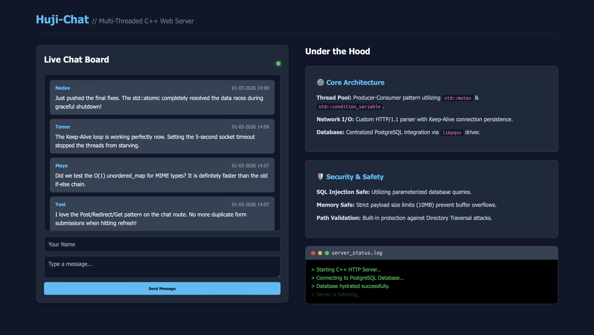

# Huji-Chat: Cloud-Native Multi-Threaded C++ Web Server


> **Enterprise-Ready Backend:** A high-performance C++ server containerized with Docker, featuring persistent PostgreSQL
storage and Kubernetes orchestration.



Huji-Chat is a custom-built, modern C++ web server that bridges low-level POSIX programming with modern cloud-native
deployment. It features a robust Producer-Consumer thread pool, a resilient PostgreSQL integration, and a built-in
real-time chat dashboard.

## Key Features

* **Custom Thread Pool:** Utilizes a Producer-Consumer pattern with `std::mutex` and `std::condition_variable` to handle
  concurrent connections efficiently.
* **PostgreSQL Integration:** Migrated from flat-file storage to a centralized PostgreSQL database using the `libpqxx`
  driver for high-concurrency data persistence.
* **Containerized Architecture:** Fully Dockerized using **Multi-Stage Builds** to produce a tiny (~20MB), secure
  production image.
* **Resilient Startup:** Implements a **Retry-Loop** connection strategy to handle database boot-up latency (race
  conditions) in containerized environments.
* **Cloud-Scale Ready:** Includes Kubernetes manifests for horizontal scaling (replicas) and self-healing via liveness
  probes.
* **Security:** Features **SQL Injection protection** via parameterized queries, built-in Directory Traversal defense,
  and strict payload limits.

## Core Architecture
### The Cloud-Native Stack

1. **Orchestration (Docker Compose):** Manages the lifecycle of both the server and the database, including virtual
   networking and persistent volumes.
2. **The Producer-Consumer Model:** The main thread (Producer) accepts sockets and pushes them to a synchronized queue.
   Worker threads (Consumers) pop sockets to execute the HTTP Keep-Alive loop and route requests.
3. **Data Persistence:** Uses Docker Volumes to ensure chat history survives container restarts and upgrades.

## Technical Challenges & Solutions
### 1. The Startup Race Condition

**Challenge:** In Docker Compose, the C++ server often boots in milliseconds, while PostgreSQL requires several seconds
to initialize its file system. This caused the server to crash on startup due to "Connection Refused."

**Solution:** I implemented a **Retry Loop** in C++. The server now gracefully waits and attempts to reconnect to the
database up to 5 times with a 2-second delay between attempts, ensuring system resilience.

### 2. SQL Injection & Thread Safety

**Challenge:** Moving to a database introduced the risk of SQL injection and the complexity of managing concurrent
database handles across multiple worker threads.

**Solution:** I utilized `pqxx::work` transactions for atomic operations and strictly enforced **parameterized queries
** (`exec_params`). This separates user data from SQL logic, making the server immune to common injection attacks.

## The Developer Dashboard

The `/chat` endpoint serves a responsive dashboard displaying live messages fetched directly from PostgreSQL and
real-time server health diagnostics.

## Getting Started
### Prerequisites

* Docker & Docker Desktop (Recommended)
* A C++20 compatible compiler (for local builds)

### Run with Docker (Easiest)

1. **Launch the entire stack:**
   ```bash
   docker-compose up --build
   ```
2. **Access the Dashboard:** Navigate to `http://localhost:9090/chat`

## Project Structure
```bash 
.
├── docker-compose.yml # Local orchestration & volumes
├── Dockerfile         # Multi-stage production build
├── deployment.yaml    # Kubernetes scale/self-healing manifest
├── Makefile           # Build system with libpqxx linking
├── include/           # Header files
├── src/               # Implementation files
├── public/            # Static assets (HTML/CSS/JS)
└── server.conf        # Port & Thread configuration
```